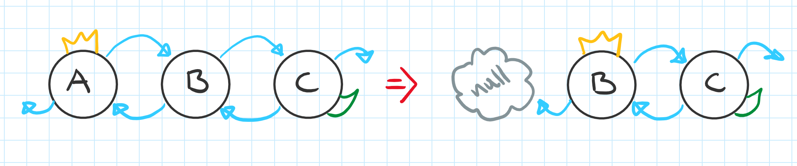
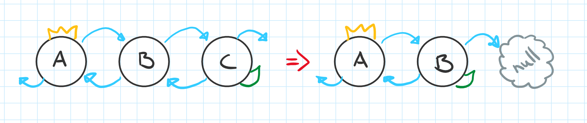
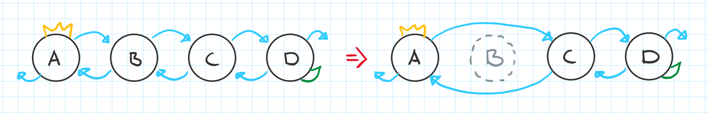

# Obligatorisk oppgave 2 i Algoritmer og Datastrukturer

Denne oppgaven er en innlevering i Algoritmer og Datastrukturer. 
Oppgaven er levert av følgende studenter:
* Kristin Hauso, a362060, s362060@oslomet.no
* Alex Vu, s186969, s186969@oslomet.no
* Lelia Marcela Marcau, s358978, s358978@oslomet.no
* Knut Andreas Grove, s358979, s358979@oslomet.no

# Arbeidsfordeling

I oppgaven har vi hatt følgende arbeidsfordeling:
* Kristin har hatt hovedansvar for oppgave...
* Alex har hatt hovedansvar for oppgave 3 og 6
* Lelia har hatt hovedansvar for oppgave 2, 7 og 10.
* Knut har hatt hovedansvar for oppgave...

# Oppgavebeskrivelse

<h3>Oppgave 1</h3>
...

<h3>Oppgave 2</h3>
VIKTIG NOTAT FOR OPPGAVE 2:

Oppgaven er avhengig av at hele oppgave 1 er riktig, inkludert metoden tom() fra oppgave 1. Vi kastet bort en hel dag på å finne hvorfor oppgave 2 ikke besto testen. Det var ingenting feil i oppgave 2, feilen var i oppgaven 1 i tom() metode, selv om oppgave 1 besto testene.

I oppgave 2 vi gikk frem ved å:

a)	Lage metoden String toString(). Metoden tar in ingen parametre og returnerer en string med vedriene i listen eller en [] hvis listen er tom. Metoden bruker StringBuilder for å bygge strengen. Metoden starter fra hode, og så langt listen inneholder verdier, verdiene skal append til strengen.

b)	Lage metoden String omvendtString(). Den ligner på metoden i punkt a, bare at i steded for å bygge strengen fra hode til hale, bygger strengen fra hale til hode og derfor returnerer en streng med verdier i omvendt rekkefølge enn verdiene i listen. Metoden starter fra hale, og så langt listen inneholder verdier, verdiene skal append til strengen.

Vi teste begge metodene i en main metode som skal ikke leveres med oppgaven. 

<h3>Oppgave 3</h3>

Besvarelsen vil begynne med å gjøre rede for oppgave 3a).

I finnNode(int indeks) starter metoden med å lete etter en node ved hjelp av en if-setning. Dersom 
«indeks» er mindre enn («antall» / 2), vil metoden gå gjennom en for-løkke som øker «hode» til neste 
verdi. Dersom «indeks» er større enn («antall» / 2), for-løkken starte fra «hale» og minske til forrige 
verdi.

I hent(int indeks) har besvarelsen hentet fra kompendiet i programkode 3.3.3.a). Denne metoden 
kontrollerer først om hvorvidt «indeks» er gyldig. Ettersom det er oppgitt false, innebærer det at 
det ikke er gyldig å oppgi «indeks» skal være lik «antall». Tilslutt returnerer den verdien som kommer 
fra finnNode(int indeks).

I oppdater(int  indeks,  T  nyverdi) begynner metoden med å sjekke om det er oppgitt null-verdier som 
ikke er tillatt. Det er også ikke tillatt å oppgi en verdi i «indeks» som er lik «antall». Deretter 
erstatter metoden verdien på «indeks» med «nyverdi» ved hjelp av hjelpevariabel. Tilslutt returnerer 
metoden den opprinnelige verdien.'

Herunder vil besvarelsen gjøre rede for oppgave 3b).

Besvarelsen har hentet metoden fratilKontroll() fra kompendiet i 1.2.3  «Feil og unntak». Denne metoden 
sørger for at tabellintervallet a[fra:til> (fra og med «fra», til men ikke med «til») er lovlig. Det gjøres 
oppmerksom på at oppgaveteksten skriver at at ArrayIndexOutOfBoundsException skal byttes med 
IndexOutOfBoundsException. I følge testen som var vedlagt i den obligatoriske oppgaven, ville testen 
ikke godkjenne IndexOutOfBoundsException i den siste if-setningen. Besvarelsen har derfor valgt å følge 
testen som ønsket å bytte ArrayIndexOutOfBoundsException med IllegalArgumentException.

I subliste(int  fra,  int  til) starter metoden å bruke fratilKontroll() for å «indeks» fra og til er 
lovlige. Deretter lager metoden en liste ved hjelp av en for-løkke som tar inn verdiene i finnNode(fra).
Tilslutt returnerer metoden listen.

<h3>Oppgave 4</h3>
...

<h3>Oppgave 5</h3>
...

<h3>Oppgave 6</h3>

Besvarelsen vil gjøre rede for metodene T fjern(int indeks) og boolean fjern(T verdi).

I T fjern(int indeks) har besvarelsen hentet inspirasjon fra programkode 3.3.3.b). Metoden starter først å 
undersøke om hvorvidt verdien i «indeks» som er lik «antall, der det ikke er tillatt. Videre har det blitt 
lagt inn fire if-setninger for å slette etterspurt element.

Den første setningen sjekker om det finnes bare ett element og setter hode og hale til null.

Den andre setningen sjekker om oppgitt «indeks» er 0, også kjent som «hode». Videre sier denne setningen 
at neste verdi skal være den nye «hode» før den setter null-verdi på den opprinnelige «hode».

Den tredje setningen sjekker om oppgitt «indeks» er «hale». Deretter setter den forrige verdi til den 
nye «hale» og setter null-verdi på den opprinnelige «hale».

Ellers vil den siste setningen dirigere pekerne forbi det oppgitte elementet.

Metoden avslutter ved å øke «endringer» og redusere «antall» med henholdsvis med en og returnerer tilslutt 
verdien til oppgitt «indeks».

<h3>Oppgave 7</h3>
Vi gikk frem ved å:

    a)	Lage en void nullstill1() som skal «tømme» listen og nulle alt. Koden er basert på oppgave 2, Avsnitt 3.3.2. Metoden start i hode og gå mot hale med en while løkke og nulles nodene fram til aller er nullet ut. Til slutt settes både hode og hale til null, antall til 0 og endringer økes.

 b)	Lage en void nullstill2() metoden som inneholder en løkke som kaller på metoden fjern() som tar in en index fra oppgave 6 og som går gjennom listen med en while løkke, fram til listen er tom.

Tidsmåling. Vi gjorde tidsmålinger på disse to metodene. For dette måtte vi lage en ny metode som generer random integer lister public static Integer[] random(Integer[] a)som blir transformert til DobbeltLenketListe. Begge metodene ble brukt på disse listene og vi fikk følgende resultater:
    Ved små lister (1 000 000 noder), metoden nullstill2() er raskere (8 millisekunder) enn nullstill1() (28 millisekunder). Hvis antall noder økes stadig, blir nullstill1() raskere enn nullstill2(). Med 10 000 000 noder er metodene omtrent like: nullstill1() tar 68 millisekunder og nullstill2() 72 millisekunder.  Med 40 000 000 noder blir metoden nullstill1() bedre: 222 millisekunder vs. 248 millisekunder for nullstill2(). Derfor velger vi nullstill1().

<h3>Oppgave 8</h3>
...

<h3>Oppgave 9</h3>
...

<h3>Oppgave 10</h3>

Koden i denne oppgaven er basert på oppgave 4 i 4.2.4.

Vi gikk frem ved å finner antall noder i listen og bruke dette for en while løkke som kjører så langt listen har fortsatt noder. Inni while løkken er det en indeks, en kandidat til minst verdi og en itarator som itererer gjennom lista i en for løkke. Med bruk av .comparator(), sammenligner verdien som ble satt som minst verdi med neste verdi i listen. Hvis neste verdi er mindre enn min (kandidaten til minst verdi), settes indeks lik i og min verdien oppdateres. Dette gjøres fram til alle nodene sjekkes. Til slutt kalles det leggInn(T verdi) metoden fra oppgave 2b) som legger inn den verdien som blir returnert med metoden fjern() fra oppgave 6.

Tidsmålinger
Samme som I oppgave 7, vi brukte dobbel lenket liste av integers for å teste tidsbruk med dette metoden. Dette ble kjørt i en main metoden som blir ikke leverte med oppgaven.
Med en liste på 90 000 noder, brukte metoden 12462 millisekunder. Ved dobling av listen (180 0000 noder), brukte metoden 49993 millisekunder. Derfor kan vi konkludere at metoden har kvadratisk kompleksitet.

